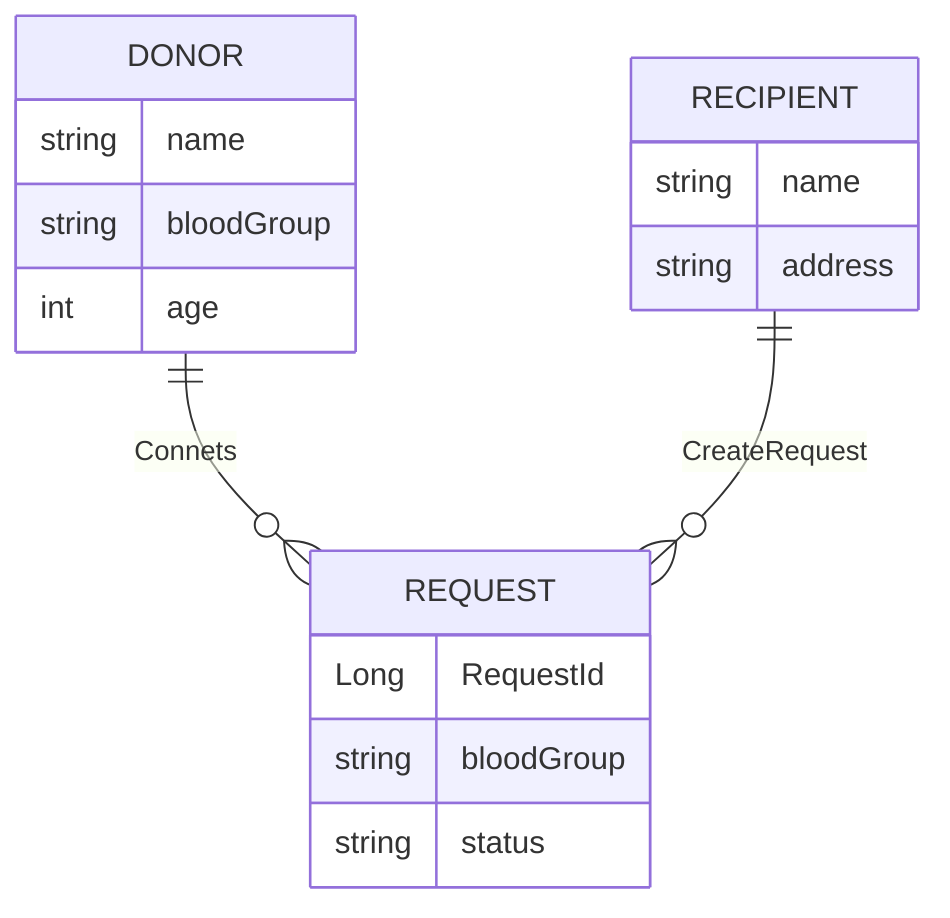

<<<<<<< HEAD
# blood-donor
=======
# BloodDonor

A full stack restful Application to connect with real time donors for voluntary blood donation.

## Technologies used:

- Spring Boot
- Spring Security
- Spring Data JPA
- PostgreSQL

<<<<<<< HEAD
## Challenges

- MultipleBagFetchException

=======

## Challenges
- MultipleBagFetchException

## ER Diagram

