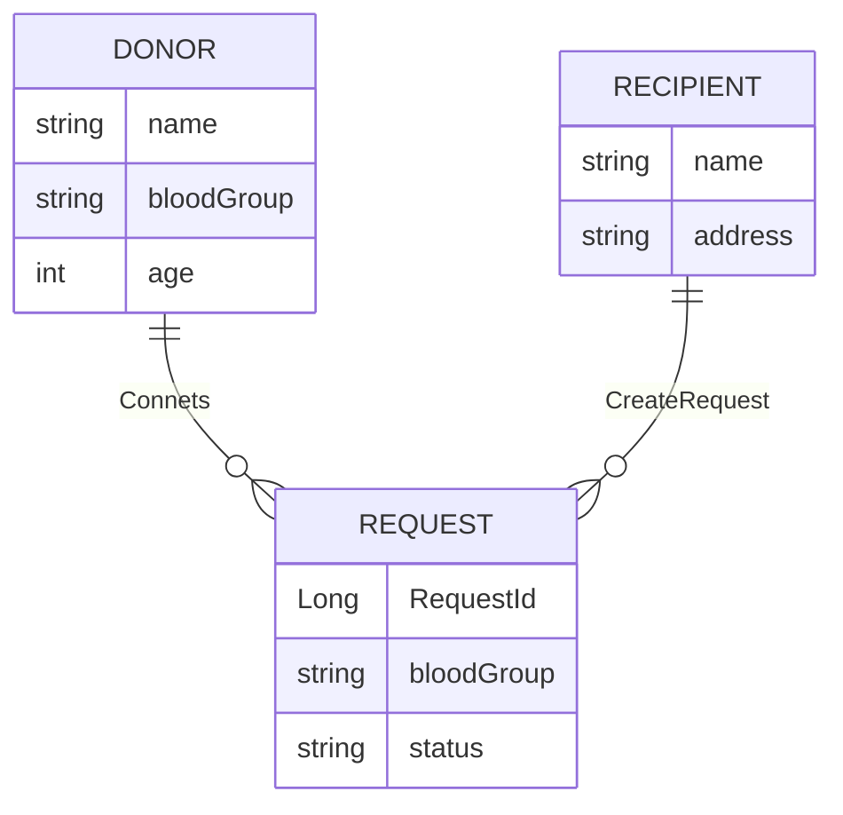

# BloodDonor

A full stack restful Application to connect with real time donors for voluntary blood donation.

## Technologies used:

### Frontend
- React
- axios

### Backend
- Spring Boot
- Spring Security
- Spring Data JPA
- PostgreSQL

## Challenges
- MultipleBagFetchException

## ER Diagram

More than 10 million developers use Twilio’s platform to add customer engagement solutions to their products and services.